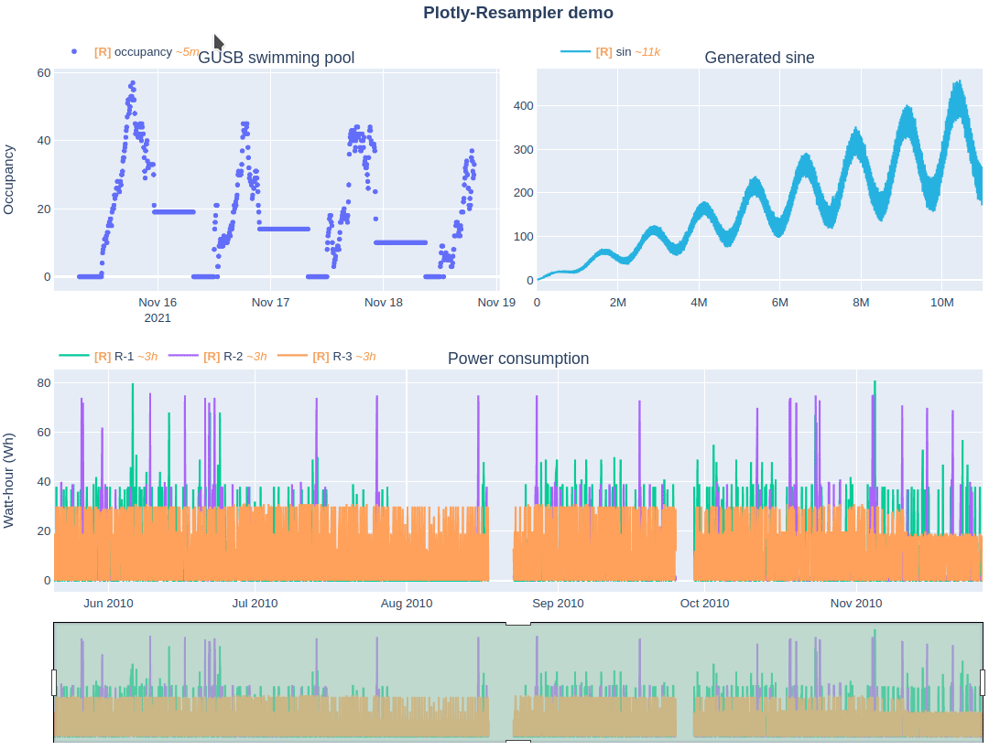
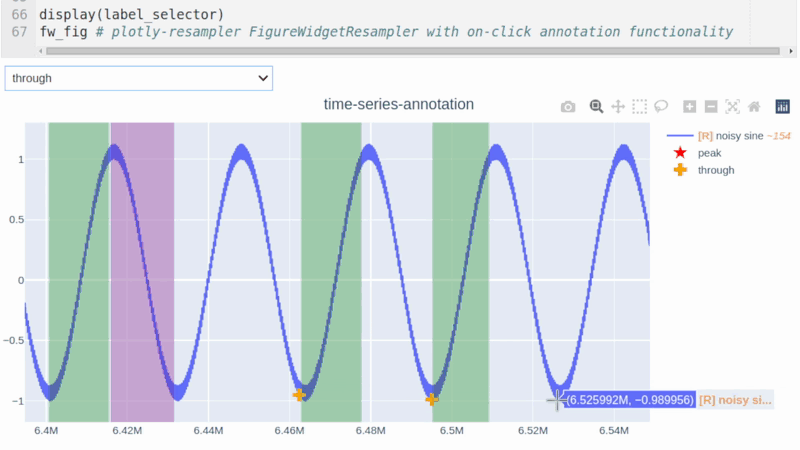
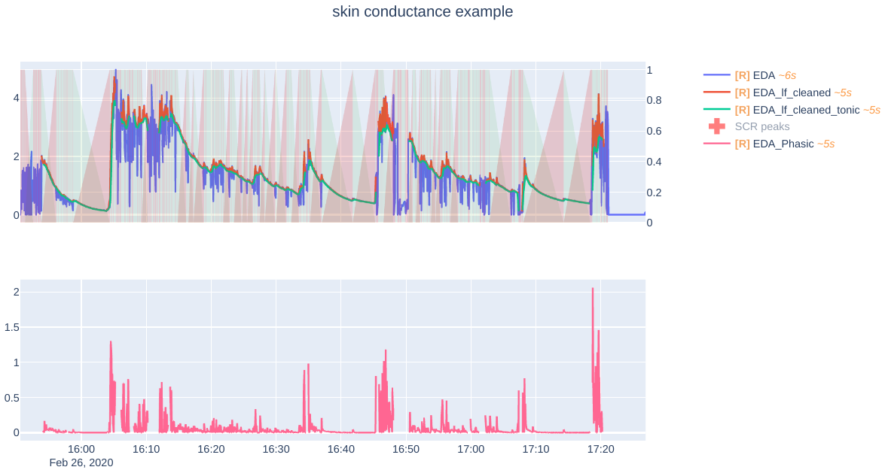
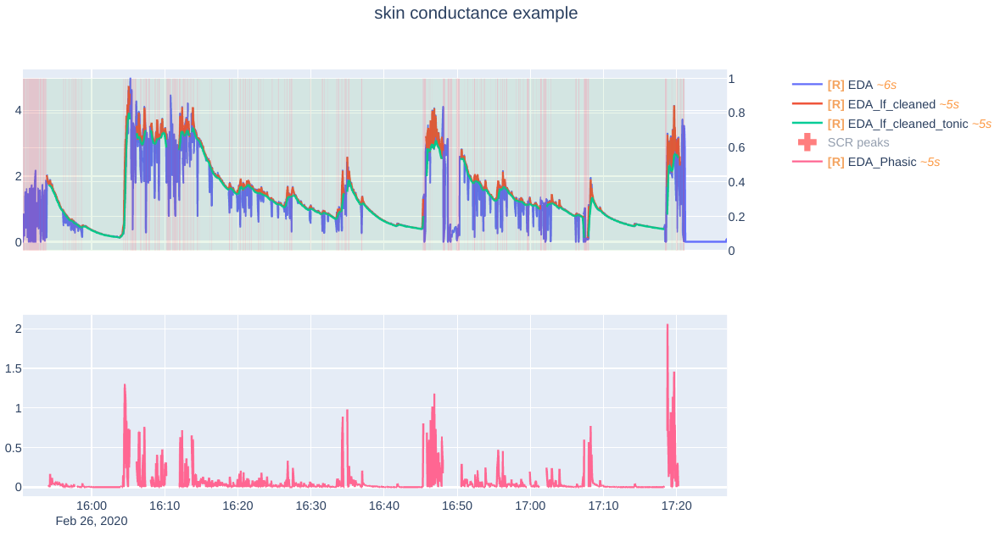

# Get started 🚀

The `plotly-resampler` package offers two primary modules:

- [`figure_resampler`][figure_resampler]: a wrapper for _plotly.graph_objects Figures_,
  coupling dynamic resampling functionality with the _Figure_.
- [`aggregation`][aggregation]: This module contains interfaces for the various aggregation methods implemented in [tsdownsample](https://github.com/predict-idlab/tsdownsample).

## Installation ⚙️

Install via [pip](https://pypi.org/project/plotly-resampler/):

```
pip install plotly-resampler
```

## Usage 📈

Plotly-Resampler facilitates dynamic resampling in two ways:

- **Automatic Approach** (low code overhead)
    - utilize the [`register_plotly_resampler`][registering.register_plotly_resampler] function
    - steps:
        1. Import and invoke [`register_plotly_resampler`][registering.register_plotly_resampler]
        2. That's it! 🎉<br>Just proceed with your standard gaph construction workflow.
    - Upon unvoking [`register_plotly_resampler`][registering.register_plotly_resampler], all new defined plotly graph objects are transformed into either 
      [`FigureResampler`][figure_resampler.FigureResampler] or
      [`FigureWidgetResampler`][figure_resampler.FigureWidgetResampler] object.  The `mode` parameter in this method determines which resampling Figure type is used.

- **Manual Approach** (data aggregation configurability, graph construction speedups)
    1. By utilizing [Dash](https://github.com/plotly/dash) callbacks to augment a `go.Figure` with dynamic aggregation functionality.
        - steps:
            1. wrap the plotly Figure with [`FigureResampler`][figure_resampler.FigureResampler]
            2. call [`.show_dash()`][figure_resampler.FigureResampler.show_dash] on the Figure
        !!! note
            This is particularly advantageous when working with Dash or outside Jupyter environments.

    2. By utilizing [FigureWidget.layout.on_change](https://plotly.com/python-api-reference/generated/plotly.html?highlight=on_change#plotly.basedatatypes.BasePlotlyType.on_change)
      , when a `go.FigureWidget` is used within a `.ipynb` environment.
        - steps:
            1. wrap your plotly Figure
              (can be a `go.Figure` with [`FigureWidgetResampler`][figure_resampler.FigureWidgetResampler])
            2. output the `FigureWidgetResampler` instance in a cell

            !!! note
                This is especially useful when developing in `jupyter` environments and when **you cannot open/forward a network-port.**


!!! tip

    For **significant faster initial loading** of the Figure, we advise to 

    1. wrap the constructor of the plotly Figure with either [`FigureResampler`][figure_resampler.FigureResampler] or [`FigureWidgetResampler`][figure_resampler.FigureWidgetResampler]
    2. add the trace data as `hf_x` and `hf_y`

!!! note

    Any plotly Figure can be wrapped with dynamic aggregation functionality! 🎉<br>
    But **only** `go.Scatter/go.Scattergl` traces **will be resampled**!

## Examples ✅

### register_plotly_resampler

```python
import plotly.graph_objects as go; import numpy as np
from plotly_resampler import register_plotly_resampler, unregister_plotly_resampler

# Call the register function once and all Figures/FigureWidgets will be wrapped
# according to the register_plotly_resampler its `mode` argument
register_plotly_resampler(mode='auto')

x = np.arange(1_000_000)
noisy_sin = (3 + np.sin(x / 200) + np.random.randn(len(x)) / 10) * x / 1_000


# when working in an IPython environment, this will automatically be a
# FigureWidgetResampler else, this will be an FigureResampler
f = go.Figure()
f.add_trace({"y": noisy_sin + 2, "name": "yp2"})
f

# to undo the wrapping, call the unregister_plotly_resampler function
```

### FigureResampler

```python
# NOTE: this example works in a notebook environment
import plotly.graph_objects as go; import numpy as np
from plotly_resampler import FigureResampler

x = np.arange(1_000_000)
sin = (3 + np.sin(x / 200) + np.random.randn(len(x)) / 10) * x / 1_000

fig = FigureResampler(go.Figure())
fig.add_trace(go.Scattergl(name='noisy sine', showlegend=True), hf_x=x, hf_y=sin)

fig.show_dash(mode='inline')
```

### Overview

In the example below, we demonstrate the (x-axis)`overview` feature of plotly-ressampler.
For more information you can check out the [examples](https://github.com/predict-idlab/plotly-resampler/tree/main/examples) to find dash apps and in-notebook use-cases.

!!! Note:
  - This overview is only available for the `FigureResampler` and not for the `FigureWidgetResampler`.
  - As a recent and experimental feature, user feedback is crucial. Please report any issues encountered!




### FigureWidget

The gif below demonstrates the example usage of [`FigureWidgetResampler`][figure_resampler.FigureWidgetResampler], where `JupyterLab` is used as the environment and the `FigureWidgetResampler`.<br><br>
Note how (i) the figure output is redirected into a new view, and (ii) how you are able to dynamically add traces!


Furthermore, plotly’s `FigureWidget` allows to conveniently add callbacks to for example click events. This allows creating a high-frequency time series annotation app in a couple of lines; as shown in the gif below and in this [notebook](https://github.com/predict-idlab/plotly-resampler/blob/main/examples/figurewidget_example.ipynb).



## Important considerations & tips 🚨

- When running the code on a server, you should forward the port of the
  [`FigureResampler.show_dash`][figure_resampler.FigureResampler.show_dash] method to your local machine.  
  **Note** that you can add dynamic aggregation to plotly figures with the
  [`FigureWidgetResampler`][figure_resampler.FigureWidgetResampler] wrapper without needing to forward a port!
- In general, when using downsampling one should be aware of (possible) [aliasing](https://en.wikipedia.org/wiki/Aliasing) effects.
  The `[R]` in the legend indicates when the corresponding trace is resampled (and thus possibly distorted).
  The `~ delta` suffix in the legend represents the mean index delta for consecutive aggregated data points.
- The plotly **autoscale** event (triggered by the autoscale button or a double-click within the graph),
  **does not reset the axes but autoscales the current graph-view of plotly-resampler figures**.
  This design choice was made as it seemed more intuitive for the developers to support this behavior
  with double-click than the default axes-reset behavior.
  The graph axes can ofcourse be resetted by using the reset_axis button.
  If you want to give feedback and discuss this further with the developers, see this issue [#49](https://github.com/predict-idlab/plotly-resampler/issues/49).

### Dynamically adjusting the scatter data 🔩

The raw high-frequency trace data of plotly-resampler figures can be adjusted using the `hf_data` property.

Working example ⬇️:

```python
import plotly.graph_objects as go; import numpy as np
from plotly_resampler import FigureResampler
# Note: a FigureWidgetResampler can be used here as well

# Construct the hf-data
x = np.arange(1_000_000)
sin = (3 + np.sin(x / 200) + np.random.randn(len(x)) / 10) * x / 1_000

fig = FigureResampler(go.Figure())
fig.add_trace(go.Scattergl(name='noisy sine', showlegend=True), hf_x=x, hf_y=sin)
fig.show_dash(mode='inline')

# After some time -> update the hf_data y property of the trace
# As we only have 1 trace, this needs to be mapped
fig.hf_data[-1]['y'] = - sin ** 2
```

!!! note

    _hf_data_ only withholds high-frequency traces (i.e., traces that are aggregated).
    To add non high-frequency traces (i.e., traces with fewer data points than _max_n_samples_),
    you need to set the `limit_to_view` argument to _True_ when adding the corresponding trace with the
    [`add_trace`][figure_resampler.figure_resampler_interface.AbstractFigureAggregator.add_trace] function.

!!! tip

    The `FigureWidgetResampler` graph will not be automatically redrawn after adjusting the fig its _hf_data_ property.
    The redrawing can be triggered by manually calling either:

    - [`FigureWidgetResampler.reload_data`][figure_resampler.FigureWidgetResampler.reload_data],
    which keeps the current-graph range.
    - [`FigureWidgetResampler.reset_axes`][figure_resampler.FigureWidgetResampler.reset_axes],
    which performs a graph update.

### Plotly-resampler & not high-frequency traces 🔍

!!! tip

    In the _Skin conductance example_ of the [basic_example.ipynb](https://github.com/predict-idlab/plotly-resampler/tree/main/examples),
    we deal with such low-frequency traces.

The `add_trace` method allows configuring argument which allows us to deal with low-frequency traces.

#### Use-cases

- **not resampling** trace data: To achieve this, set:

  - `#!python max_n_samples = len(hf_x)`

- **not resampling** trace data, but **slicing to the view**: To achieve this, set:
  - `#!python max_n_samples = len(hf_x)`
  - `#!python limit_to_view = True`

!!! note

    For, **irregularly sampled traces** which are **filled** (e.g. _colored background_ signal quality trace of the skin conductance example),
    it is important that you set `gap_handler` to `NoGapHandler` for that trace.

    Otherwise, when you leave `gap_handler` to `MedDiffGapHandler`, you may get weird background shapes such as ⬇️:
    

    When `gap_handler` is set to `NoGapHandler` you get ⬇️:
    
